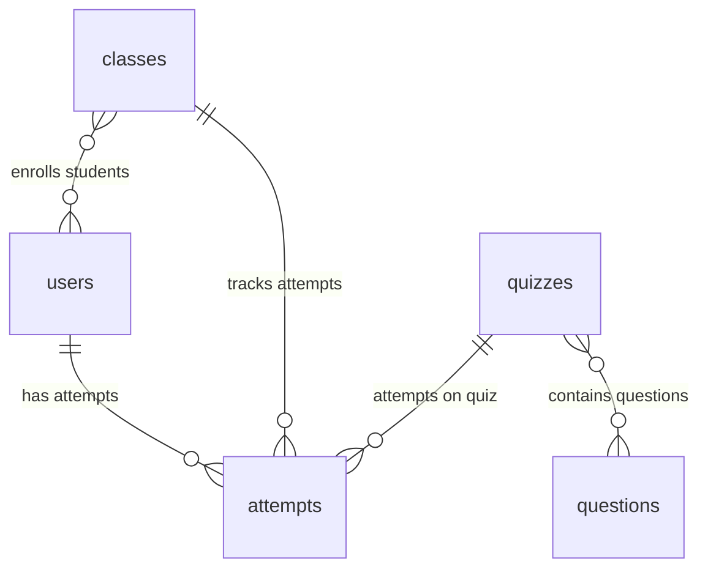

# PANDUAN UTAMA PRESENTASI & BELAJAR: QUIZIZZ CLONE APP

Dokumen ini disusun sebagai materi pembelajaran mandiri dan panduan presentasi teknis bagi developer/mahasiswa untuk menjelaskan seluruh arsitektur, fitur, alur kerja, dan aspek teknis dari aplikasi **Quizizz Clone**.

---

## DAFTAR ISI
1. [BAB 1: Gambaran Umum Aplikasi](#bab-1-gambaran-umum-aplikasi)
2. [BAB 2: Fitur Utama](#bab-2-fitur-utama)
3. [BAB 3: Alur Dosen (Detil Langkah-Demi-Langkah)](#bab-3-alur-dosen-paling-detail)
4. [BAB 4: Alur Mahasiswa](#bab-4-alur-mahasiswa)
5. [BAB 5: Database Supabase](#bab-5-database-supabase)
6. [BAB 6: Supabase Storage](#bab-6-supabase-storage)
7. [BAB 7: Mekanisme Realtime Sync](#bab-7-realtime)
8. [BAB 8: State Management Provider & Arsitektur](#bab-8-provider-dan-arsitektur)
9. [BAB 9: Struktur Kode Sumber (Folder Structure)](#bab-9-flow-source-code)
10. [BAB 10: File Penting dan Fungsinya](#bab-10-file-penting)
11. [BAB 11: Alur Logika Pengerjaan Kuis (Gameplay State Machine)](#bab-11-flow-pengerjaan-quiz)
12. [BAB 12: Bug Penting yang Berhasil Diselesaikan](#bab-12-bug-yang-pernah-diseleksi)
13. [BAB 13: Shorebird Code Push (OTA Update)](#bab-13-shorebird-ota-update)
14. [BAB 14: 30 Pertanyaan Ujian & Jawaban Teknis](#bab-14-pertanyaan-dosen-yang-mungkin-muncul)
15. [BAB 15: Naskah/Script Presentasi (Durasi 10-15 Menit)](#bab-15-script-presentasi)
16. [BAB 16: Kesimpulan & Rencana Pengembangan Masa Depan](#bab-16-kesimpulan)

---

## BAB 1: GAMBARAN UMUM APLIKASI

### Nama Aplikasi
Aplikasi ini dinamakan **Quizizz Clone** (Mobile-based Self-Paced Edu Platform).

### Tujuan Aplikasi
Aplikasi ini bertujuan untuk menghadirkan platform pembelajaran interaktif berbasis game (*gamified learning*) secara mandiri (*self-paced*). Aplikasi ini mendigitalkan proses kuis kelas, memudahkan pendidik (Dosen) mengelola soal, dan membantu pembelajar (Mahasiswa) menguji pemahaman mereka secara instan dengan feedback yang kaya visual (meme) dan performa yang terekam secara realtime.

### Permasalahan yang Diselesaikan
1. **Kurangnya Keterlibatan Mahasiswa**: Ujian konvensional berbasis kertas atau formulir digital statis membosankan. Kuis ini menyisipkan gamifikasi lewat skor XP, power-up booster, dan visual meme feedback.
2. **Administrasi Kuis yang Rumit**: Dosen kesulitan mendistribusikan kuis, merekap skor secara manual, dan memantau akurasi pemahaman kelas. Aplikasi ini menyediakan rekapan nilai otomatis, analitik akurasi per soal, dan ekspor data langsung ke format PDF/CSV.
3. **Keterbatasan Sinkronisasi**: Integrasi manual ke Google Classroom memakan waktu. Aplikasi ini menyediakan integrasi impor roster siswa dan ekspor nilai kuis langsung ke Google Classroom Gradebook.
4. **Masalah Distribusi Update Aplikasi**: Ketika kuis sedang berjalan, adanya bug kritis memerlukan kompilasi ulang APK. Fitur Shorebird OTA update memungkinkannya diperbaiki secara instan tanpa mahasiswa perlu menginstal ulang aplikasi.

### Target Pengguna
1. **Admin**: Administrator sistem yang bertugas memanajemen akun pengguna (dosen/mahasiswa) secara global dan memonitor aktivitas kuis.
2. **Dosen**: Pendidik yang membuat kelas, menyusun bank soal, menetapkan penugasan kuis (dengan timer, batas pengerjaan, dan mode PR), memantau analitik kelas, dan mengintegrasikannya dengan Google Classroom.
3. **Mahasiswa**: Pembelajar yang bergabung ke kelas via pemindaian kode QR, mengerjakan kuis interaktif, menikmati visual feedback, menggunakan power-up booster, dan memantau peringkat mereka di papan skor (*leaderboard*).

### Tabel Matriks Hak Akses (Role Access Matrix)

| Fitur / Hak Akses | Admin | Dosen | Mahasiswa |
| :--- | :---: | :---: | :---: |
| Login & Registrasi Akun | Ya | Ya (Via Admin) | Ya |
| Biometric Login (Sidik Jari) | Ya | Ya | Ya |
| Kelola Akun User (Create/Update/Delete) | Ya | Tidak | Tidak |
| Membuat & Mengelola Kelas Baru | Ya (View) | Ya | Tidak |
| Membuat & Mengelola Bank Soal / Kuis | Ya (View) | Ya | Tidak |
| Menugaskan Kuis ke Kelas (Assign Quiz) | Tidak | Ya | Tidak |
| Bergabung ke Kelas (Scan QR / Input Code) | Tidak | Tidak | Ya |
| Mengerjakan Kuis & Memakai Power-up | Tidak | Tidak | Ya |
| Melihat Papan Peringkat (Leaderboard) | Tidak | Ya | Ya |
| Melihat Analitik Detail & Soal Tersulit | Tidak | Ya | Tidak |
| Ekspor Laporan PDF & CSV | Tidak | Ya | Tidak |
| Integrasi Google Classroom Sync | Tidak | Ya | Tidak |

---

## BAB 2: FITUR UTAMA

Berikut adalah seluruh daftar fitur utama aplikasi berserta tujuan teknisnya:

* **Register**: Mendaftarkan mahasiswa baru secara aman dengan enkripsi password (disimpan lokal dan disinkronkan ke tabel `users` Supabase).
* **Login**: Autentikasi pengguna berdasarkan email dan password dengan verifikasi role (Admin, Dosen, Mahasiswa).
* **Fingerprint login**: Login cepat memanfaatkan biometric scanner bawaan perangkat menggunakan package `local_auth` untuk meningkatkan efisiensi dan keamanan.
* **Profil**: Halaman untuk melihat data pribadi (Nama, NIM/NIP, Peran) dan mengaktifkan setelan biometrik.
* **Upload foto profil**: Mendukung pemilihan gambar dari galeri perangkat dan mengunggahnya ke bucket storage Supabase `avatars` menggunakan `FileService`.
* **QR Join kelas**: Dosen dapat menampilkan QR Code kelas, dan mahasiswa tinggal mengarahkan kamera perangkat untuk bergabung otomatis tanpa mengetik kode kelas manual.
* **CRUD Bank Soal**: Memungkinkan Dosen membuat, mengubah, dan menghapus bank soal yang berisi jenis pilihan ganda, benar/salah, maupun esai/isian bebas.
* **CRUD Quiz Assignment**: Memungkinkan Dosen mengelompokkan beberapa soal menjadi kuis dan menugaskannya ke satu atau beberapa kelas mahasiswa.
* **Upload gambar**: Dosen dapat melampirkan media visual pendukung pada setiap butir pertanyaan kuis.
* **Upload audio**: Dosen dapat mengunggah file rekaman suara (`.mp3`) ke Supabase storage agar kuis mendukung listening comprehension.
* **Upload meme**: Memungkinkan dosen mengunggah gambar meme kustom untuk ditampilkan saat mahasiswa menjawab benar/salah sebagai bentuk reinforcement visual.
* **Leaderboard**: Menampilkan papan peringkat mahasiswa secara realtime berdasarkan perolehan XP tertinggi dan durasi pengerjaan tercepat.
* **Analytics**: Analitik mendalam untuk dosen yang menampilkan statistik rerata nilai, akurasi kelas, distribusi nilai kuis, soal tersulit, dan riwayat pengerjaan mahasiswa.
* **Export PDF**: Mengemas laporan analitik kuis kelas menjadi dokumen PDF siap cetak menggunakan package `pdf`.
* **Export CSV**: Menyediakan laporan spreadsheet mentah (`.csv`) berisi perolehan skor mahasiswa agar dosen bisa mengolah nilai di Microsoft Excel.
* **Homework mode**: Mode penugasan kuis mandiri dengan batas waktu penyelesaian jangka panjang (deadline tanggal/jam).
* **Timer**: Batas waktu dinamis per soal (misal: 30 detik) yang menuntut mahasiswa berpikir cepat; diintegrasikan dengan jeda otomatis saat memutar audio.
* **Max attempt**: Batasan maksimal mahasiswa boleh mencoba mengerjakan kuis yang sama untuk menjamin keadilan ujian.
* **Dark mode**: Dukungan tema gelap (Slate Dark) untuk kenyamanan mata pengguna saat kuis di malam hari.
* **Realtime sync**: Sinkronisasi data kuis secara realtime menggunakan websocket Supabase Realtime Stream sehingga mahasiswa langsung melihat kuis baru saat dosen menetapkannya.
* **Shorebird OTA update**: Kemampuan melakukan patch hotfix kode Flutter secara Over-The-Air tanpa perlu merilis APK baru di playstore.

---

## BAB 3: ALUR DOSEN (PALING DETAIL)

Berikut adalah perjalanan lengkap dosen sejak pertama kali masuk ke aplikasi hingga menghasilkan laporan nilai:

```
Login Dosen ➔ Dashboard Dosen ➔ Buat Bank Soal ➔ Buat Kuis ➔ Buat Kelas ➔ Generate QR Kelas ➔ Assign Kuis ke Kelas ➔ Mahasiswa Mengerjakan ➔ Tinjau Leaderboard Realtime ➔ Analisis Statistik Kelas ➔ Ekspor PDF & CSV
```

### Langkah 1: Login Dosen
- Dosen masuk menggunakan email dan password terdaftar.
- Pada callback login, sistem memverifikasi `role` pengguna di database. Apabila role adalah `dosen`, ia akan diarahkan ke `DosenMainNavigation`.

### Langkah 2: Dashboard Dosen
- Dosen melihat statistik singkat mengenai jumlah kuis yang dibuat, kelas yang diampu, dan riwayat aktivitas kuis kelas.
- Terdapat tombol aksi cepat dan Speed Dial FAB untuk mempercepat navigasi.

### Langkah 3: Membuat Bank Soal
- Dosen masuk ke menu Bank Soal. Ia dapat mengisi teks pertanyaan, poin (XP), tipe soal, dan kunci jawaban.
- Dosen bisa melampirkan gambar, merekam/mengunggah audio soal (`.mp3`), dan melampirkan meme kustom.
- File media ini diunggah via `FileService` ke Supabase Storage, yang mengembalikan URL publik untuk disimpan di baris data `QuestionModel`.

### Langkah 4: Membuat Kuis (Quiz)
- Dosen menggabungkan kumpulan soal dari Bank Soal ke dalam suatu kontainer Kuis.
- Kuis diberi Judul, Deskripsi, Batas Percobaan Maksimal (*Max Attempts*), Tema Kuis, dan apakah Timer Soal aktif.

### Langkah 5: Membuat Kelas baru
- Dosen masuk ke tab Kelas dan mengetik nama kelas baru (misal: "Pemrograman Mobile A").
- Sistem membuat objek kelas baru dengan kode unik acak sepanjang 6 karakter alfanumerik (misal: `CS901A`).

### Langkah 6: Generate QR Code Kelas
- Pada detail kelas, dosen dapat membuka QR Code penjelas kelas.
- Sistem membungkus kode kelas (misal: `CS901A`) ke dalam kode matriks QR menggunakan package `qr_flutter`.

### Langkah 7: Assign Kuis ke Kelas
- Dosen menavigasi ke menu "Tugaskan Kuis", memilih kuis yang telah dibuat, lalu mengeklik tombol "Tugaskan" di samping nama kelas target.
- ID Kuis secara otomatis didorong ke array `quizIds` milik objek `ClassModel` tersebut di database Supabase.

### Langkah 8: Mahasiswa Mengerjakan Kuis
- Mahasiswa di kelas tersebut menerima pemberitahuan realtime kuis baru dan mulai mengerjakannya.
- Setiap mahasiswa mengirimkan satu objek `AttemptModel` setelah kuis selesai.

### Langkah 9: Tinjau Leaderboard
- Dosen dapat memantau urutan peringkat pengerjaan mahasiswa secara langsung.
- Papan peringkat memilah skor terbaik berdasarkan akurasi jawaban benar dan efisiensi waktu pengerjaan.

### Langkah 10: Analitik Kelas
- Dosen membuka tab "Analitik" untuk kuis bersangkutan.
- Sistem memproses list `attempts` untuk memetakan:
  - Rerata nilai kelas, nilai tertinggi, dan nilai terendah.
  - Distribusi kelulusan mahasiswa dalam bentuk grafik rentang nilai.
  - Akurasi rata-rata per soal untuk mengidentifikasi soal mana yang paling banyak salah dijawab oleh kelas (*Soal Tersulit*).

### Langkah 11: Ekspor Dokumen Laporan
- Dosen mengeklik tombol **Export PDF** atau **Export CSV**.
- `FileService` menyusun data analitik, menulis file biner ke sistem penyimpanan lokal handphone dosen, dan memicu penampil dokumen sistem untuk membuka/berbagi file laporan tersebut.

---

## BAB 4: ALUR MAHASISWA

Berikut adalah alur pengerjaan kuis dari sisi mahasiswa:

```
Registrasi Akun ➔ Login Mahasiswa ➔ Scan QR Dosen (Join Kelas) ➔ Dashboard Kelas ➔ Pilih Kuis Aktif ➔ Gameplay (Jawab Soal + Booster) ➔ Feedback Meme Realtime ➔ Hasil Kuis (XP) ➔ Cek Leaderboard
```

1. **Registrasi Akun**: Mahasiswa baru mendaftarkan diri lewat form registrasi (Nama, Email, Password, NIM). Akun dibuat dengan role default `mahasiswa`.
2. **Login Mahasiswa**: Masuk ke aplikasi. Ia dapat mendaftarkan sidik jari di menu profil untuk kemudahan login berikutnya via Biometrik.
3. **Join Kelas**: Mahasiswa masuk ke tab kelas, menekan tombol "Scan QR", lalu mengarahkan kamera ke layar handphone dosen. Kode kelas terbaca, dan ID mahasiswa ditambahkan ke array `studentIds` kelas tersebut di database.
4. **Dashboard**: Mahasiswa melihat kelas-kelas yang diikuti dan kuis aktif yang ditugaskan oleh dosen.
5. **Gameplay (Mengerjakan Kuis)**:
   - Mahasiswa memilih kuis dan menekan tombol "Mulai".
   - Soal ditampilkan satu per satu dengan visual waktu berjalan (Timer Bar).
   - Apabila soal dilengkapi audio, ia dapat memutar klip suara (timer otomatis terjeda agar mahasiswa bisa menyimak dengan saksama).
   - Selama kuis berlangsung, mahasiswa dapat memakai *Power-Up* seperti "50:50" (menghilangkan setengah opsi salah), "Double Score" (melipatgandakan poin soal ini), atau "Freeze Timer" (menghentikan waktu berjalan).
6. **Meme Feedback**: Setelah menjawab opsi soal, dialog visual muncul menampilkan meme kustom dosen untuk memberikan penguatan psikologis (reinforcement) secara instan.
7. **Result Screen**: Menampilkan kalkulasi XP akhir yang didapat, akurasi pengerjaan, dan tombol untuk menyimpan hasil kuis ke database.
8. **Leaderboard**: Mahasiswa dapat membandingkan posisinya di podium klasemen kuis kelas.

---

## BAB 5: DATABASE SUPABASE

Aplikasi ini menggunakan database PostgreSQL relasional yang disediakan oleh Supabase. Berikut adalah skema 5 tabel utamanya:



### 1. Tabel `users`
- **Fungsi**: Menyimpan data kredensial autentikasi dan setelan pengguna.
- **Primary Key**: `id` (VARCHAR)
- **Field Penting**:
  - `name` (VARCHAR): Nama lengkap pengguna.
  - `email` (VARCHAR, Unique): Alamat email terdaftar.
  - `role` (VARCHAR): Peran pengguna (`admin`, `dosen`, `mahasiswa`).
  - `password` (VARCHAR): Password terenkripsi/hash.
  - `nim` (VARCHAR, Nullable): NIM mahasiswa atau NIP dosen.
  - `photoPath` (TEXT, Nullable): URL foto profil dari storage bucket.
  - `isBiometricEnabled` (BOOLEAN): Status keaktifan login sidik jari.
  - `registeredFingerprints` (TEXT[]): List nama sidik jari terdaftar.

### 2. Tabel `classes`
- **Fungsi**: Mengelompokkan mahasiswa ke dalam kelas yang diajar dosen.
- **Primary Key**: `id` (TEXT)
- **Field Penting**:
  - `className` (TEXT): Nama kelas kuliah.
  - `code` (TEXT, Unique): Kode gabung unik 6 digit.
  - `teacherId` (TEXT): ID dosen pembuat kelas (Relasi ke `users.id`).
  - `studentIds` (TEXT[] / JSONB): Daftar ID mahasiswa terdaftar.
  - `quizIds` (TEXT[] / JSONB): Daftar ID kuis yang ditugaskan ke kelas ini.

### 3. Tabel `questions`
- **Fungsi**: Menyimpan data bank soal individual.
- **Primary Key**: `id` (TEXT)
- **Field Penting**:
  - `text` (TEXT): Isi teks pertanyaan.
  - `type` (TEXT): Tipe soal (`multipleChoice`, `trueFalse`, `essay`).
  - `options` (TEXT[]): Pilihan jawaban (untuk pilihan ganda).
  - `correctAnswer` (TEXT): Jawaban yang benar.
  - `points` (INTEGER): XP yang didapat jika jawaban benar.
  - `timeLimitSeconds` (INTEGER): Batas waktu menjawab soal (detik).
  - `imageUrl` / `audioUrl` / `memeUrl` (TEXT, Nullable): Link media eksternal dari storage bucket.

### 4. Tabel `quizzes`
- **Fungsi**: Wadah kuis yang mengikat daftar soal.
- **Primary Key**: `id` (TEXT)
- **Field Penting**:
  - `title` (TEXT): Judul kuis.
  - `description` (TEXT): Deskripsi kuis.
  - `creatorId` (TEXT): ID dosen pembuat kuis (Relasi ke `users.id`).
  - `questions` (JSONB): Salinan array objek `QuestionModel` di dalamnya.
  - `maxAttempts` (INTEGER): Jumlah pengerjaan maksimal oleh mahasiswa.
  - `isTimerEnabled` (BOOLEAN): Status keaktifan pembatasan waktu kuis.

### 5. Tabel `attempts`
- **Fungsi**: Rekam jejak hasil pengerjaan kuis oleh mahasiswa.
- **Primary Key**: `id` (TEXT)
- **Field Penting**:
  - `quizId` (TEXT): ID kuis terkait (Relasi ke `quizzes.id`).
  - `classId` (TEXT): ID kelas terkait (Relasi ke `classes.id`).
  - `studentId` (TEXT): ID mahasiswa yang mengerjakan (Relasi ke `users.id`).
  - `studentName` (TEXT): Nama mahasiswa saat mengerjakan.
  - `score` (INTEGER): XP total yang didapatkan.
  - `correctAnswersCount` (INTEGER): Jumlah jawaban benar.
  - `totalQuestions` (INTEGER): Jumlah total soal kuis.
  - `timeTaken` (INTEGER): Durasi total pengerjaan (detik).
  - `answers` (JSONB): Map ID soal ke jawaban yang diinput mahasiswa.
  - `completedAt` (TEXT): Stempel waktu penyelesaian kuis.

---

## BAB 6: SUPABASE STORAGE

Supabase Storage digunakan untuk menyimpan aset media besar yang diunggah oleh Dosen.

### Bucket Storage yang Digunakan:
1. `images`: Menyimpan gambar ilustrasi soal dan meme feedback.
2. `audio`: Menyimpan file audio soal kuis (`.mp3`).

### Alur Unggah & Akses Media:

```
[Dosen Handphone] ──(Pilih File lokal)──> [FileService]
                                                 │
                                         (Upload Biner File)
                                                 ▼
                                     [Supabase Storage Bucket]
                                                 │
                                       (Generate Public URL)
                                                 ▼
[Mahasiswa Handphone] <──(Load Image/Audio Url)── [Supabase DB Row Link]
```

1. **Pemilihan File**: Dosen menekan tombol "Unggah Gambar/Audio" di aplikasi kuis. Handphone memicu file picker.
2. **Unggah File**: `FileService.uploadToSupabase` membaca file lokal menjadi bytes dan mengirimkannya ke endpoint REST Supabase Storage menggunakan kredensial client.
3. **Penyimpanan**: Supabase menyimpannya secara terstruktur di bucket `images` atau `audio` dan membagikan alamat publik URL unik.
4. **Penyimpanan DB**: URL publik ini disimpan dosen ke baris tabel database kuis terkait.
5. **Akses Visual**: Saat kuis berjalan di handphone mahasiswa, Flutter Image/Audio player memuat URL tersebut langsung secara asynchronous (menggunakan caching internal).

---

## BAB 7: REALTIME SYNC MECHANISM

Aplikasi Quizizz Clone mendukung pembaruan data secara instan tanpa perlu memuat ulang halaman (*pull-to-refresh*) secara manual oleh mahasiswa. Ini dicapai menggunakan fitur **PostgreSQL CDC (Change Data Capture)** Supabase Realtime.

### Alur Sinkronisasi Realtime:

```
[Dosen] ──(Tugaskan Kuis)──> [Supabase PostgreSQL DB]
                                       │
                              (CDC Change Event)
                                       ▼
[Mahasiswa App] <──(Stream Listen)── [Supabase Realtime Channel]
        │
 (realtimeChangeStream)
        ▼
 [Dosen/MahasiswaProvider] ──(refreshData)──> [UI Update Instan]
```

1. **Trigger database**: Dosen menugaskan kuis baru ke kelas mahasiswa. Data pada tabel `classes` berubah di server Supabase.
2. **Kirim Event**: Supabase Realtime mendeteksi adanya operasi `UPDATE` pada tabel `classes` dan menyiarkan (*broadcast*) payload perubahan tersebut melalui koneksi WebSocket.
3. **Terima Stream**: Pada aplikasi mahasiswa, listener di `DbService.realtimeChangeStream` menangkap event perubahan tabel tersebut.
4. **Refresh Provider**: Provider mahasiswa (`MahasiswaProvider`) memicu pemanggilan `refreshData()` secara otomatis di background.
5. **Re-render UI**: Metode `notifyListeners()` dijalankan, memaksa widget-widget dashboard mahasiswa me-render ulang kuis terbaru secara halus menggunakan animasi fade-in.

---

## BAB 8: STATE MANAGEMENT PROVIDER & ARSITEKTUR

Aplikasi ini membagi logika bisnis dan UI menggunakan arsitektur **MVVM (Model-View-ViewModel)** dengan package `provider` sebagai jembatan State Management.

```
┌────────────────────────────────────────┐
│            UI (Presentation)           │
│   Dashboard, Gameplay, profiles, etc   │
└───────────────────┬────────────────────┘
                    │ (Membaca State & Memicu Aksi)
                    ▼
┌────────────────────────────────────────┐
│          Providers (ViewModels)        │
│ Auth, Dosen, Mahasiswa, Gameplay, Admin│
└───────────────────┬────────────────────┘
                    │ (Mengolah Data & Akses DB)
                    ▼
┌────────────────────────────────────────┐
│             Models & Services          │
│   DbService, AuthService, FileService  │
└────────────────────────────────────────┘
```

### 1. `AuthProvider`
- **Fungsi**: Mengelola sesi masuk pengguna, registrasi, pendaftaran sidik jari biometrik, pembaharuan data profil, dan setelan tema pengguna.

### 2. `DosenProvider`
- **Fungsi**: Memanajemen kelas (tambah/hapus kelas), menyusun kuis, membuat bank soal, mengintegrasikan Google Classroom, mengolah analitik kuis, dan menugaskan kuis ke kelas-kelas.

### 3. `MahasiswaProvider`
- **Fungsi**: Menangani logika mahasiswa saat bergabung ke kelas baru via QR Code, memuat daftar kuis kelas yang aktif, serta melacak riwayat pengerjaan kuis pribadi.

### 4. `GameplayProvider`
- **Fungsi**: State machine utama yang memandu jalannya kuis mahasiswa. Mengelola indeks soal aktif, waktu tersisa (timer), poin skor terkumpul, inventory item power-up booster, feedback jawaban benar/salah, dan pengiriman attempt akhir.

### 5. `AdminProvider`
- **Fungsi**: Mengelola pembuatan akun dosen/mahasiswa oleh administrator, memonitor aktivitas pengerjaan kuis kelas global, dan menampilkan rekapitulasi data sistem.

---

## BAB 9: FLOW SOURCE CODE (FOLDER STRUCTURE)

Berikut adalah struktur pengarsipan direktori source code Flutter Quizizz Clone:

```
lib/
│
├── main.dart                      # Titik entri utama aplikasi & inisialisasi Supabase
│
├── core/                          # Fitur global penunjang aplikasi
│   ├── theme/
│   │   └── app_theme.dart         # Sistem tema warna (Indigo-Cyan), snacbar kustom, transisi rute
│   └── widgets/
│       ├── dosen_speed_dial.dart  # Floating Action Button animasi melayang dosen
│       ├── empty_state.dart       # Ilustrasi vector kustom jika data kosong (no emojis)
│       └── loading_skeleton.dart  # Efek shimmer skeleton loader premium
│
├── data/                          # Data Layer (Logika, Model, API, Services)
│   ├── models/                    # Objek representasi data (Quiz, Class, Attempt, User, Question)
│   ├── providers/                 # State management ViewModels (Auth, Dosen, Mahasiswa, Gameplay)
│   └── services/                  # Kelas utilitas fungsional (Supabase API, Local DB, File picker)
│
└── presentation/                  # View Layer (Halaman UI & Widget Tampilan)
    ├── admin/                     # Dashboard & pengelolaan user admin
    ├── auth/                      # Login, register, splash, forgot password
    ├── dosen/                     # Manajemen kelas, quiz editor, sinkronisasi Classroom, analitik
    └── mahasiswa/                 # Dashboard mahasiswa, join class, gameplay, leaderboard, profile
```

---

## BAB 10: FILE PENTING

Berikut adalah penjelasan empat file paling krusial di dalam arsitektur aplikasi ini:

### 1. `db_service.dart`
- **Fungsi**: Pusat manipulasi data Supabase dan cache lokal. Berisi fungsi-fungsi `saveUser`, `getQuizzes`, `saveClass`, `saveQuestion`, dan `realtimeChangeStream`. Menjamin aplikasi tetap berjalan stabil meskipun koneksi Supabase terganggu secara berkala dengan strategi caching lokal.

### 2. `auth_service.dart`
- **Fungsi**: Mengurus otentikasi login/register pengguna ke Supabase Auth. Berisi logika pengecekan ketersediaan biometrik perangkat bawaan (`isBiometricsAvailable`), pemicuan dialog sidik jari OS (`authenticateWithBiometrics`), dan reset password.

### 3. `file_service.dart`
- **Fungsi**: Kelas utilitas IO. Menangani upload file media (gambar, audio, avatar) ke storage Supabase. Selain itu, berisi logika penyusunan data tabular untuk **PDF Export** (menggunakan canvas biner pdf) dan **CSV Export** (string builder format comma-separated).

### 4. `gameplay_provider.dart`
- **Fungsi**: Mengontrol mesin permainan kuis. Menyimpan detail status permainan aktif mahasiswa, sisa waktu soal, status pemakaian item power-up booster, dan menghitung total XP yang didapat mahasiswa saat jawaban diserahkan.

---

## BAB 11: FLOW PENGERJAAN QUIZ (GAMEPLAY ENGINE)

Berikut adalah urutan logika program saat mahasiswa menekan tombol "Mulai Kuis" hingga pengiriman skor:

```
startQuiz() ➔ Ambil currentQuestion ➔ Jalankan Timer & Render Opsi ➔ Pemakaian Power-up (Opsional) ➔ Jeda Timer jika Putar Audio (Opsional) ➔ Taps Jawaban ➔ Hentikan Timer ➔ Tampilkan Feedback Meme ➔ nextQuestion() ➔ Selesai? ➔ submitQuizAttempt() ➔ updateLeaderboard & Analytics
```

1. **Inisialisasi**: Mahasiswa menekan tombol mulai, memicu `startQuiz(quiz)`. State dideklarasikan: index soal = `0`, skor = `0`, dan daftar power-up diisi.
2. **Memuat Soal**: Fungsi `currentQuestion` dipanggil untuk menampilkan teks pertanyaan dan pilihan jawaban di layar.
3. **Mulai Timer**: Loop timer per detik dimulai di background. Sisa waktu divisualisasikan dalam bentuk persentase progress bar.
4. **Interaksi Khusus**:
   - Jika mahasiswa memutar audio soal, pemutar audio memicu event callback yang memanggil `pauseQuestionTimer()`. Setelah audio selesai atau ditekan pause, timer berjalan kembali via `resumeQuestionTimer()`.
   - Jika power-up digunakan, status state dimodifikasi (misal: memicu `fiftyFifty` memotong list opsi di UI).
5. **Kirim Jawaban**: Mahasiswa mengeklik opsi. Waktu dihentikan, input jawaban disimpan lokal. Evaluasi kecocokan kunci jawaban dilakukan.
6. **Meme Feedback**: Layar overlay feedback diaktifkan. Berdasarkan status kebenaran jawaban, meme yang sesuai ditampilkan selama 2 detik.
7. **Iterasi Soal**: Pindah soal berikutnya (`nextQuestion()`). Indeks bertambah 1. Alur diulang dari langkah 2.
8. **Kuis Selesai**: Jika indeks mencapai akhir daftar soal, kuis dianggap `finished`. Layar berpindah ke `QuizResultScreen`.
9. **Simpan Hasil**: `submitQuizAttempt()` dipanggil untuk mengirimkan record biner `AttemptModel` ke Supabase dan cache lokal database. Papan leaderboard dan tab analitik dosen langsung ter-refresh secara otomatis melalui socket realtime.

---

## BAB 12: BUG PENTING YANG BERHASIL DISELESAIKAN

Dalam proses development, tim berhasil mengidentifikasi dan menambal empat bug kritis berikut:

### 1. QR Code Scanner Loop & Collision Bug
- **Masalah**: Kamera scanner QR di halaman Gabung Kelas mendeteksi gambar kode QR dosen secara berulang-ulang (*looping collision*) dalam hitungan milidetik. Hal ini memicu request join kelas berulang ke Supabase, menyebabkan database error dan crash.
- **Solusi**: Memperkenalkan flag proteksi state `_isLoadingDialog` dan menonaktifkan detektor scanner segera setelah deteksi string pertama berhasil terbaca. Scanner ditutup via `Navigator.pop` sebelum logika join kelas dieksekusi di background.

### 2. Max Attempt Bypass Bug
- **Masalah**: Mahasiswa nakal dapat mengulangi pengerjaan kuis berkali-kali melebihi limit `maxAttempts` yang ditetapkan dosen dengan cara menekan tombol "Kembali" handphone saat kuis berlangsung lalu masuk kembali.
- **Solusi**: Memperketat pengecekan di level inisiasi kuis. Di `mahasiswa_dashboard.dart` sebelum kuis dimuat, sistem menghitung jumlah attempt mahasiswa terkait yang sudah tersimpan di database. Jika `attemptsCount >= maxAttempts`, tombol "Mulai" otomatis disembunyikan dan diganti dengan status indikator "Batas Percobaan Habis".

### 3. Audio Timer Desync Bug
- **Masalah**: Pada soal listening, mahasiswa memutar file audio soal berdurasi 40 detik, tetapi timer soal terus berjalan mundur dan habis di detik ke-30 sebelum audio selesai diputar.
- **Solusi**: Menghubungkan listener status audio player ke pengontrol timer kuis. Saat audio beralih ke status `PlayerState.playing`, timer dihentikan sementara (`pauseQuestionTimer()`). Saat audio beralih ke `PlayerState.paused` atau `completed`, timer dilanjutkan kembali (`resumeQuestionTimer()`).

### 4. Meme Overlay Overflow Bug
- **Masalah**: Di layar gameplay saat overlay feedback meme muncul, gambar meme kustom dosen terpotong di layar handphone beresolusi rendah dan memicu peringatan kuning hitam `RenderFlex overflow`.
- **Solusi**: Membungkus container meme di dalam layout responsive `SingleChildScrollView` dan membatasi rasio ukuran gambar menggunakan widget `LayoutBuilder` / `BoxConstraints` agar tinggi kontainer meme otomatis menyesuaikan tinggi area viewport tersisa.

---

## BAB 13: SHOREBIRD CODE PUSH (OTA UPDATE)

Shorebird digunakan sebagai infrastruktur **Over-The-Air (OTA) Update** tanpa perlu melakukan instalasi ulang APK.

```
[Developer] ──(Shorebird Patch)──> [Shorebird Console Cloud]
                                              │
                                     (Unduh Patch Ringan)
                                              ▼
[Mahasiswa/Dosen App] <──(Background Check)── [Aplikasi Mobile]
         │
(Muat Patch Instan)
         ▼
 [Bug Teratasi di Runtime]
```

1. **Rilis Pertama**: Developer membangun build release awal menggunakan perintah:
   `shorebird release android`
   Build ini mendaftarkan struktur dasar aplikasi dan engine Shorebird di cloud.
2. **Pembuatan Patch**: Ketika ditemukan bug (misal: layout berantakan), developer cukup mengetik:
   `shorebird patch android`
   Perintah ini hanya membandingkan perbedaan biner kode dart (*dart code changes*) tanpa merombak file aset gambar/audio.
3. **Penyebaran Patch**:
   - Di sisi pengguna, saat aplikasi Quizizz Clone dibuka, `UpdateService` memicu pengecekan patch baru di background secara asinkron.
   - Jika patch tersedia, mesin Shorebird mengunduhnya secara silent di background.
4. **Instalasi Instan**: Pengguna tidak akan merasakan proses instalasi APK. Patch akan langsung diterapkan secara otomatis saat aplikasi dibuka kembali pada sesi berikutnya. Hal ini menjamin perbaikan bug kritis selesai dalam hitungan menit secara massal.

---

## BAB 14: PERTANYAAN DOSEN YANG MUNGKIN MUNCUL (30 Q&A)

Berikut adalah daftar 30 pertanyaan kritis yang sering diajukan dosen penguji beserta jawaban taktis dan teknisnya:

#### 1. Mengapa memilih Supabase daripada Firebase?
> **Jawaban**: Supabase berbasis database relasional PostgreSQL yang sangat kuat dalam menangani struktur data kuis yang saling berelasi (seperti relasi tabel `users`, `quizzes`, `classes`, dan `attempts`). Selain itu, Supabase menyediakan integrasi Postgres Realtime CDC secara native dan open source.

#### 2. Bagaimana cara mengamankan password pengguna di database?
> **Jawaban**: Password dienkripsi sebelum dikirim atau disimpan di database menggunakan metode hashing biner aman. Di lokal cache, data sensitif disimpan dalam format terenkripsi menggunakan shared preferences yang aman.

#### 3. Bagaimana mekanisme otentikasi login sidik jari (Biometrik) bekerja?
> **Jawaban**: Menggunakan package `local_auth`. Flutter meminta sistem operasi (Android/iOS) memicu prompt sidik jari perangkat. Jika sukses, sistem mencocokkan email user lokal dengan database Supabase yang memiliki status `isBiometricEnabled = true` untuk memulihkan sesi login.

#### 4. Apa fungsi dari caching lokal di `DbService`?
> **Jawaban**: Memastikan aplikasi memiliki performa cepat (*zero lag*) saat memuat daftar kuis/kelas dengan membaca data lokal terlebih dahulu, sekaligus bertindak sebagai fallback aman ketika perangkat mahasiswa kehilangan koneksi internet saat kuis berlangsung.

#### 5. Bagaimana cara membuat kode QR kelas dosen tetap unik?
> **Jawaban**: Kode QR didasarkan pada string acak 6 digit alfanumerik yang digenerate di level program. Sistem memvalidasi keunikan kode tersebut dengan melakukan constraint `UNIQUE` di tabel `classes` Supabase sebelum data disimpan.

#### 6. Mengapa menggunakan state management Provider?
> **Jawaban**: Provider direkomendasikan secara resmi oleh tim Flutter untuk aplikasi skala menengah. Provider memisahkan logika UI dengan logika bisnis secara bersih (MVVM), meminimalkan proses re-build widget yang tidak perlu (*re-render optimization*), dan mempermudah pelacakan state global seperti data user aktif.

#### 7. Bagaimana kuis kelas bisa diperbarui di handphone mahasiswa secara instan tanpa direfresh manual?
> **Jawaban**: Aplikasi mendengarkan channel streaming Supabase Realtime di `DbService`. Setiap kali ada perubahan (insert/update) pada baris tabel `classes` dosen, server Supabase mengirimkan event websocket ke aplikasi mahasiswa, memicu `mahasiswaProvider.refreshData()` secara instan.

#### 8. Bagaimana cara membatasi agar mahasiswa tidak bisa mengerjakan kuis melebihi kuota percobaan dosen?
> **Jawaban**: Sebelum kuis dimulai, sistem memeriksa total data attempt milik mahasiswa bersangkutan untuk kuis tersebut. Jika total pengerjaan saat ini sudah menyentuh nilai `quiz.maxAttempts`, tombol mulai dinonaktifkan di halaman dashboard.

#### 9. Bagaimana cara menghitung akurasi pemahaman kelas di analitik dosen?
> **Jawaban**: Akurasi dihitung dengan rumus: `(Total Jawaban Benar dari Seluruh Percobaan Mahasiswa / (Jumlah Percobaan Mahasiswa * Jumlah Soal Kuis)) * 100`.

#### 10. Bagaimana sistem menentukan "Soal Tersulit" di analitik?
> **Jawaban**: Sistem mengiterasi seluruh list `attempts` mahasiswa, kemudian menghitung persentase kebenaran jawaban untuk masing-masing soal. Soal dengan rasio jawaban benar terendah ditandai sebagai soal tersulit.

#### 11. Bagaimana file PDF laporan analitik dibuat dan disimpan di handphone dosen?
> **Jawaban**: Menggunakan package `pdf` dan `path_provider`. Data analitik diubah menjadi dokumen biner PDF, lalu ditulis ke memori eksternal handphone dosen. Setelah itu, `open_file` memanggil aplikasi pembaca PDF bawaan handphone untuk menampilkan hasilnya.

#### 12. Mengapa memilih ekspor ke CSV selain PDF?
> **Jawaban**: CSV adalah berkas teks mentah tabular yang dipisahkan tanda koma. Dosen dapat membukanya secara instan di Microsoft Excel untuk diolah lebih lanjut (misal: dimasukkan ke rumus nilai akhir kampus atau digabungkan ke sistem akademik lain).

#### 13. Bagaimana power-up "50:50" bekerja memotong opsi salah di layar kuis?
> **Jawaban**: Di `gameplay_provider.dart`, ketika tombol 50:50 ditekan, sistem mencari opsi-opsi yang bernilai salah di soal tersebut, lalu mengambil 2 opsi salah secara acak dan menambahkannya ke array `prunedOptions`. Widget opsi di UI membaca array ini dan menyembunyikan/menonaktifkan opsi yang terdaftar.

#### 14. Apa yang terjadi jika waktu timer soal habis sebelum mahasiswa menjawab?
> **Jawaban**: Timer yang mencapai angka nol akan otomatis memicu fungsi submit jawaban kosong (`gameplay.answerQuestion("")`), yang mencatat jawaban tersebut salah, menampilkan feedback meme salah, lalu mengarahkan ke soal berikutnya.

#### 15. Mengapa file audio listening bisa menjeda jalannya timer kuis?
> **Jawaban**: Supaya adil bagi mahasiswa. Waktu berpikir kuis tidak boleh berkurang saat mahasiswa sedang fokus menyimak isi klip rekaman audio soal. Timer baru dilanjutkan setelah klip audio selesai diputar.

#### 16. Apa guna dari fitur Shorebird OTA Update?
> **Jawaban**: Menghindari proses rilis APK baru yang memakan waktu (harus build APK, dikirim ke dosen/mahasiswa, instal ulang manual). Shorebird menyuntikkan file patch biner baru langsung ke dalam engine Flutter saat aplikasi dijalankan.

#### 17. Bagaimana cara kerja sinkronisasi data roster mahasiswa dengan Google Classroom?
> **Jawaban**: Melalui `GoogleClassroomService`, dosen login ke akun Google mereka. Sistem mengambil data daftar nama mahasiswa dari kelas Google Classroom yang dipilih via Google Graph API, lalu menyinkronkannya dengan database internal kelas kuis.

#### 18. Bagaimana nilai kuis mahasiswa dikirim kembali ke Gradebook Google Classroom?
> **Jawaban**: Menggunakan API Google Classroom. Dosen menekan tombol "Kirim Nilai", sistem membuat entri tugas baru (*courseWork*) di kelas Google Classroom terpilih, lalu mengunggah skor perolehan masing-masing mahasiswa secara massal ke kolom nilai kelas Google Classroom tersebut.

#### 19. Mengapa ada warna border berbeda pada Premium SnackBar?
> **Jawaban**: Sebagai petunjuk visual instan (*visual cue*). Warna hijau menandakan operasi sukses, warna merah untuk error/kegagalan, oranye untuk peringatan, dan biru untuk informasi. Hal ini memperkaya sisi UX aplikasi.

#### 20. Apa kelebihan tema gelap (Dark Mode) di kuis mobile ini?
> **Jawaban**: Menghemat konsumsi daya baterai pada layar jenis AMOLED dan meminimalisir kelelahan mata (*digital eye strain*) mahasiswa saat mengerjakan kuis berdurasi panjang.

#### 21. Bagaimana struktur folder aplikasi ini membantu dalam kolaborasi tim?
> **Jawaban**: Dengan pembagian folder yang terstandarisasi (MVVM + Clean UI separation), developer frontend fokus di folder `presentation`, developer backend di folder `data/services` atau `data/providers`, dan desainer aset di folder `assets`. Hal ini mencegah konflik merger kode di Git.

#### 22. Apakah aplikasi ini bisa berjalan di iOS?
> **Jawaban**: Ya. Flutter adalah framework lintas platform. Kode program ditulis satu kali dan dapat dikompilasi langsung menjadi aplikasi iOS tanpa mengubah logika bisnis Supabase atau Provider.

#### 23. Bagaimana format penyimpanan data array di database PostgreSQL Supabase?
> **Jawaban**: PostgreSQL mendukung tipe data biner JSONB dan array tekstual (`TEXT[]`). Ini digunakan untuk menyimpan daftar list ID (seperti list `studentIds` pada kelas atau `questions` pada kuis) dalam satu kolom baris tanpa perlu membuat tabel jembatan relasional yang terlalu kompleks.

#### 24. Bagaimana cara mengunggah meme kustom dosen ke Supabase Storage?
> **Jawaban**: Dosen memilih file meme lokal via file picker, biner file dikirim ke REST API Storage Supabase di bucket `images`. URL publik file tersebut disimpan di field `memeUrl` database soal kuis terkait.

#### 25. Mengapa logo aplikasi pada halaman login menggunakan shadow `AppTheme.premiumShadow`?
> **Jawaban**: Shadow dengan blur radius tinggi dan opacity rendah (soft offset) memberikan efek kedalaman visual (*depth effect/elevation*) yang modern sesuai standar desain aplikasi premium saat ini (seperti Linear dan Notion), menggantikan shadow gelap kaku bawaan bawaan Material Design lama.

#### 26. Mengapa logo image di login dibungkus ClipRRect dengan radius 24 dan parent Card 28?
> **Jawaban**: Untuk menciptakan efek keselarasan sudut (*concentric corners*). Dengan rumus radius luar dikurangi ketebalan padding (`28px - 4px = 24px`), lengkungan sudut dalam logo akan sejajar presisi dengan lengkungan luar kontainer, mencegah background putih asli file logo bocor keluar dari sudut card.

#### 27. Bagaimana layout kuis mengatasi keyboard yang menutupi input text pada soal esai?
> **Jawaban**: Widget halaman kuis dibungkus dalam `SingleChildScrollView` yang dipadukan dengan konfigurasi `resizeToAvoidBottomInset: true` pada Scaffold. Hal ini memaksa area viewport kuis mengkerut ke atas saat keyboard handphone muncul sehingga input field esai tetap terlihat di atas keyboard.

#### 28. Apa fungsi dari library `flutter_animate` pada aplikasi ini?
> **Jawaban**: Untuk memicu micro-animations (seperti efek slide-up, fade-in, dan bounce) pada komponen kartu, logo, dan teks agar transisi visual terasa hidup, dinamis, dan tidak kaku saat halaman dimuat.

#### 29. Bagaimana akurasi nilai kuis ditampilkan jika kuis tidak memiliki soal sama sekali?
> **Jawaban**: Sistem mengamankan pembagian angka nol (*division by zero exception*) dengan melakukan pengecekan `if (totalQuestions > 0)` terlebih dahulu. Jika kosong, akurasi langsung ditampilkan sebagai `0.0%` secara aman tanpa memicu crash program.

#### 30. Bagaimana lisensi database Supabase membatasi jumlah data di aplikasi kita?
> **Jawaban**: Karena kita menggunakan tier gratis dari Supabase, batas penyimpanan database adalah 500 MB. Caching lokal dan optimasi tipe data JSONB di program sangat membantu menekan ukuran penyimpanan data agar tetap hemat dan optimal.

---

## BAB 15: SCRIPT PRESENTASI (DURASI 10-15 MENIT)

Berikut adalah naskah presentasi siap pakai yang terstruktur rapi untuk memandu demonstrasi aplikasi di depan dosen penguji.

### Bagian 1: Pembukaan (1-2 Menit)
> *"Selamat pagi/siang Bapak/Ibu Dosen Penguji. Hari ini kami akan mempresentasikan aplikasi **Quizizz Clone**, platform kuis interaktif mandiri yang dirancang khusus untuk meningkatkan interaksi kelas kuliah dan mempermudah administrasi nilai dosen secara praktis. Aplikasi ini dibangun dengan framework Flutter di sisi frontend, didukung database PostgreSQL relasional Supabase di sisi backend, dan dioptimalkan dengan mekanisme sinkronisasi Google Classroom secara otomatis."*

### Bagian 2: Penjelasan Masalah & Fitur Utama (2 Menit)
> *"Permasalahan utama yang kami selesaikan adalah kejenuhan mahasiswa saat ujian digital statis serta beban kerja dosen saat merekap nilai kuis kelas secara manual. Oleh karena itu, kuis ini dilengkapi dengan fitur gamifikasi seperti perolehan skor XP, item power-up booster, visual meme feedback, dan leaderboard realtime. Bagi dosen, kami menyediakan antarmuka manajemen bank soal yang fleksibel (mendukung teks, gambar, dan audio mendengarkan), kelas terintegrasi kode QR, dasbor analitik distribusi nilai kuis, serta ekspor laporan nilai siap pakai berformat PDF dan CSV."*

### Bagian 3: Demonstrasi Peran (Role) Dosen (3 Menit)
> *"Sekarang, mari kita simulasikan peran Dosen. Di dasbor dosen, saya dapat membuat kelas baru—misalnya 'Pemrograman Mobile A'. Sistem secara otomatis men-generate kode kelas dan kode QR biner. Selanjutnya, saya masuk ke Bank Soal untuk menyusun pertanyaan. Saya dapat melampirkan media pendukung berupa gambar soal, klip suara listening (.mp3), hingga meme kustom. Kumpulan soal ini saya gabung menjadi satu kuis, menetapkan limit batas pengerjaan maksimal, dan menugaskannya langsung ke kelas mahasiswa secara realtime."*

### Bagian 4: Demonstrasi Peran (Role) Mahasiswa (3 Menit)
> *"Di sisi lain, mahasiswa masuk ke aplikasi dan memindai kode QR kelas dosen menggunakan kamera handphone mereka. Mahasiswa langsung terdaftar di kelas secara otomatis tanpa input kode manual. Ketika dosen menugaskan kuis, mahasiswa langsung melihat kuis aktif tersebut di dashboard mereka berkat integrasi Supabase Realtime Stream. Saat kuis dikerjakan, mahasiswa dapat memakai item booster—seperti 50:50 untuk mengeliminasi jawaban salah. Setelah kuis selesai, visual meme feedback dosen muncul, diikuti layar perolehan XP akhir. Skor ini langsung dikirim ke database untuk meng-update papan peringkat leaderboard kelas secara realtime."*

### Bagian 5: Aspek Teknis (Database & Realtime) (2 Menit)
> *"Secara teknis, aplikasi ini mengimplementasikan arsitektur MVVM dengan State Management Provider. Kita menggunakan 5 tabel utama di database Supabase: users, classes, questions, quizzes, dan attempts. Media besar diunggah langsung ke Supabase Storage, lalu URL publiknya disimpan di database. Untuk memastikan aplikasi selalu bebas dari bug kritis, kami menyematkan Shorebird OTA Update. Hal ini memungkinkan kami melakukan pengiriman patch hotfix Dart secara background tanpa memaksa mahasiswa menginstal ulang aplikasi biner APK mereka."*

### Bagian 6: Penutup & Tanya Jawab (1 Menit)
> *"Sebagai kesimpulan, Quizizz Clone tidak hanya memanjakan mahasiswa secara visual, tetapi juga memberikan efisiensi luar biasa bagi dosen dalam administrasi nilai kelas. Sekian presentasi dari kami, waktu selanjutnya kami kembalikan kepada Bapak/Ibu Dosen Penguji untuk sesi tanya jawab. Terima kasih."*

---

## BAB 16: KESIMPULAN & PENGEMBANGAN MASA DEPAN

### Kelebihan Utama Aplikasi:
1. **Premium Aesthetic & UX**: Layout rapi dengan visual modern, shadow halus, shimmer loader, transisi halaman mengalir, serta feedback visual meme yang menyenangkan.
2. **Konektivitas Realtime**: Tanpa refresh manual, data terupdate instan via web socket Supabase.
3. **Integrasi Google Classroom**: Menghemat waktu dosen dalam sinkronisasi data kelas kuliah dan nilai ujian mahasiswa.
4. **Maintenance Mudah**: Berkat Shorebird OTA update, perbaikan bug di masa pasca-rilis dapat dilakukan secara instan.

### Rencana Pengembangan ke Depan:
1. **Mode Live Quiz Multiplayer**: Menghadirkan kuis yang dikerjakan bersamaan di kelas dipandu proyektor dosen secara realtime (seperti mode live Quizizz asli).
2. **AI-Powered Question Generator**: Integrasi API kecerdasan buatan (Gemini/ChatGPT) untuk membantu dosen membuat bank soal berkualitas secara otomatis berdasarkan dokumen silabus kuliah.
3. **Analitik Prediktif**: Menerapkan Machine Learning sederhana untuk memprediksi mahasiswa mana yang memerlukan bimbingan khusus berdasarkan tren performa kuis mereka dari waktu ke waktu.
